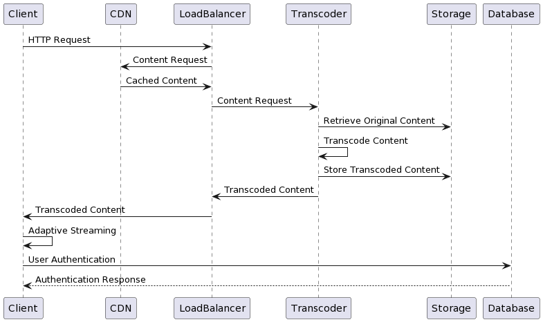

# System Architecture for Scalable Video Streaming
To design a system architecture for scalable video streaming that guarantees low latency, high availability, and adaptive streaming quality for a diverse global audience, we can consider the following components and principles:

## Content Delivery Network (CDN):

Utilize a globally distributed CDN to cache and deliver video content closer to users, reducing latency and improving availability.
Distribute content across edge servers located strategically around the world to ensure fast delivery regardless of user location.

## Load Balancing and Auto-Scaling:
Employ load balancers to distribute incoming traffic across multiple servers efficiently.
Implement auto-scaling mechanisms to automatically adjust server capacity based on demand.
Utilize containerization or serverless computing for rapid scaling and resource optimization.

## Adaptive Bitrate Streaming:

Implement Adaptive Bitrate Streaming (ABR) protocols such as HLS (HTTP Live Streaming) or MPEG-DASH (Dynamic Adaptive Streaming over HTTP).
Encode video content at multiple bitrates and resolutions to accommodate varying internet speeds and device capabilities.
Use client-side algorithms to dynamically adjust streaming quality based on available bandwidth and device performance.

## Content Transcoding and Optimization:

Perform real-time transcoding to convert video content into different formats and bitrates.
Optimize video encoding settings to balance between quality and bandwidth efficiency.
Implement caching mechanisms for frequently accessed transcoded content to reduce processing overhead.

## Global Traffic Management:

Implement DNS-based global traffic management to route users to the nearest available CDN edge server.
Utilize Anycast routing to direct users to the closest CDN node based on network proximity.

## Content Protection and Security:

Implement Digital Rights Management (DRM) solutions to protect copyrighted content from unauthorized access and distribution.
Use encryption protocols such as HTTPS (SSL/TLS) to secure video streams during transmission.
Employ token-based authentication and access control mechanisms to manage user permissions.

## Monitoring and Analytics:

Deploy monitoring tools to track system performance, latency, and user experience metrics in real-time.
Utilize analytics platforms to gather insights into user behavior, engagement, and content preferences.
Use machine learning algorithms to predict traffic patterns and optimize resource allocation.
Below is a simplified diagram illustrating the proposed

## Architecture Sequence Diagram:

<!-- link diagram png ./image.png -->

